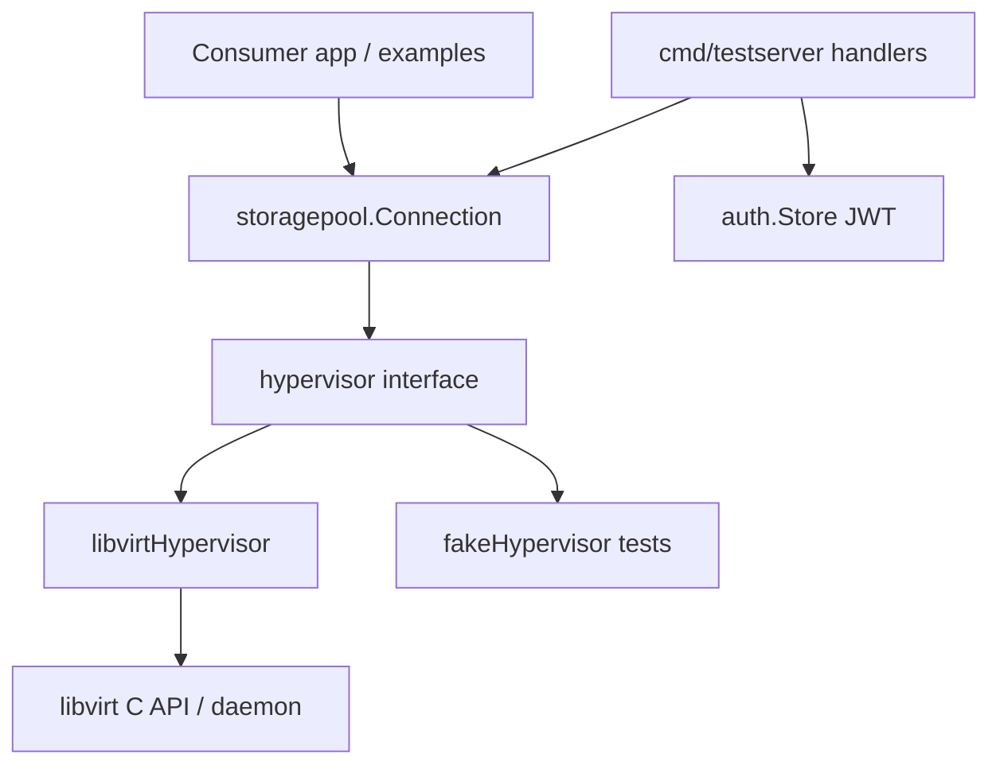

# Architecture

## Style

## Layers

| Layer | Package | Responsibility |
|-------|---------|----------------|
| Public library | `storagepool` | Typed pool ops; XML marshal/unmarshal |
| Port | `hypervisor`, `poolHandle` | Testable boundaries |
| Adapter | `libvirt_adapter.go` | Real libvirt |
| Utilities | ``utilities`` | `ConnectWithAuth`, `errors.Wrap` |
| HTTP harness | `cmd/testserver` | Auth + routes + Swagger |
| Auth | `cmd/testserver/auth` | Users YAML, bcrypt, JWT HS512 |

## Design Rules

- Library has **no** HTTP, auth, or DB
- Pool identity = **UUID string** after Define
- Concurrent pool attribute reads use `errgroup` + `Ref`/`Free`
- Errors wrapped with op name via `wrap` → ``utilities`/utils/errors`
- Testserver maps libvirt error codes → HTTP status (`httpStatusFor`)

## Boundaries

| May depend on | Must not depend on |
|---------------|-------------------|
| `storagepool` → libvirt, libvirtxml, `utilities` | `storagepool` → `cmd/testserver` |
| `cmd/testserver` → `storagepool`, auth | handlers → libvirt details except flags/types in bodies |

## Related Docs

- [DEPENDENCY_GRAPH.md](DEPENDENCY_GRAPH.md)
- [DATA_FLOW.md](DATA_FLOW.md)
- [backend/overview.md](backend/overview.md)
- [INDEX.md](INDEX.md)
