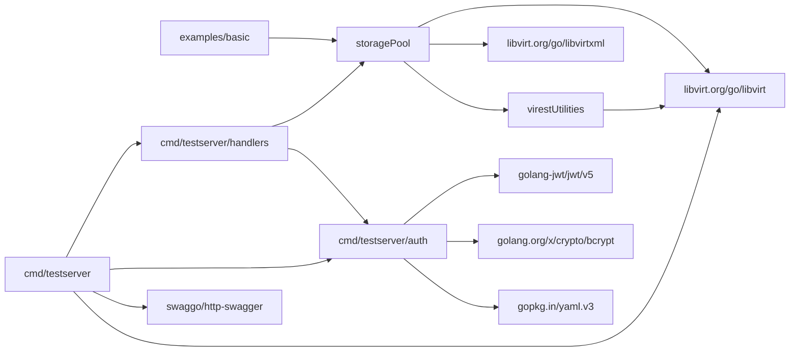

# Dependency Graph

## Package graph



## Domain call graph (library)

```text
Connect
  ├─ Define → Build → Create → Autostart
  ├─ List / Info / Detail
  ├─ Capabilities / FindSources
  ├─ Refresh
  ├─ WaitEvent / StreamEvents
  └─ Destroy → Delete → Undefine
              Close
```

## Circular dependencies

**None** among first-party packages. `storagePool` does not import `cmd/*`.

## External runtime deps

| Dep | Used for |
|-----|----------|
| libvirt daemon | All pool ops |
| CGO / libvirt headers | Build |
| JWT signing key + users.yaml | Testserver only |

## Library allowed imports

See [CODING_STANDARD.md](CODING_STANDARD.md): go-libvirt (+ libvirtxml), in-repo `virestUtilities`, stdlib.

## Related Docs

- [ARCHITECTURE.md](ARCHITECTURE.md)
- [integrations/libvirt.md](integrations/libvirt.md)
- [INDEX.md](INDEX.md)
